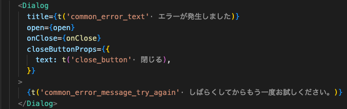
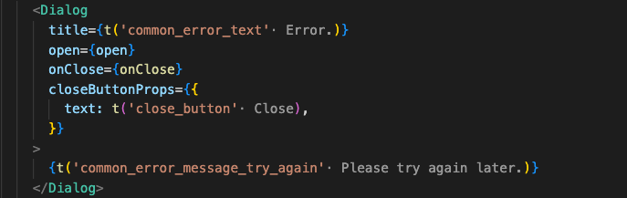

# support-i18next

TypeScript(React)で翻訳済みのラベルを表示させる vscode 拡張



displayLanguage 切り替え時



# usage

1. [リリース](https://github.com/MtBlue81/vscode-extension-support-i18next/releases)から vsix ファイルをダウンロードします。
1. Extensions のメニューから Install from VSIX をクリックして、ダウンロードしたファイルをインストールします。
1. Extensions に support-i18next としてインストールされます。

# settings

setting.json で以下の設定が可能です。

- localeFilePath と displayLanguage を組み合わせて表示される翻訳情報を切り替えられます。

| キー                                | 概要                                                                   | デフォルト値              |
| ----------------------------------- | ---------------------------------------------------------------------- | ------------------------- |
| support-i18next.localeFilePath      | 翻訳データファイルのパス<br/> {locale} に displayLanguage が挿入される | src/locales/{locale}.json |
| support-i18next.displayLanguage     | 表示言語                                                               | ja                        |
| support-i18next.simpleCallNames     | 翻訳ラベルを表示させる i18n 関数名                                     | ['t']                     |
| support-i18next.objectPropertyCalls | オブジェクトのプロパティ呼び出しを対象にするための設定                 | {}                        |

## objectPropertyCalls

- i18n 用の`t`や`$t`といったシンプルな関数ではなく、`i18n.translate`といったプロパティ呼び出し時のための設定です。

```json
  "support-i18next.objectPropertyCalls": {
    "i18n": [
      "translate",
      "t"
    ],
  }
```
